# yOura Insights Horizon

A free browser-based dashboard for exploring exported Oura Ring CSV data. Your data never leaves your browser. All parsing and dashboard generation happens locally on your device.

> [!NOTE]
> This project is a fork of DigitalDraven's yOura Insights.
>
> [Original repository](https://github.com/DigitalDraven/yOura-Insights)

> [!IMPORTANT]
> You must have a valid Oura data export. Exports are free and can be requested here: [https://membership.ouraring.com/data-export](https://membership.ouraring.com/data-export)

---

## Deployment

### Custom Page or Personal Web App

Use the hosted custom page below. You can also create a Personal Web App (PWA) on your iOS device with iOS 16.4 or later.

- [https://oura.kirkdevsecops.com](https://oura.kirkdevsecops.com)

### Local

Install dependencies and run the app locally:

```bash
npm install
npm run dev
```

Run tests:

```bash
npm test
```

Build for deployment:

```bash
npm run build
```

Host the production build locally:

```bash
npm run preview -- --host
```

> [!TIP]
> Vite will display both a Local and Network URL. Open either URL on the host machine, or use the Network URL to access the app from any device that's connected to the same local network (phone tablet, etc.)

## Overview

yOura Insights Horizon turns exported Oura CSV files into a visual health dashboard for readiness, sleep, activity, stress, resilience, cardiovascular health, biometrics, and ring wear coverage.

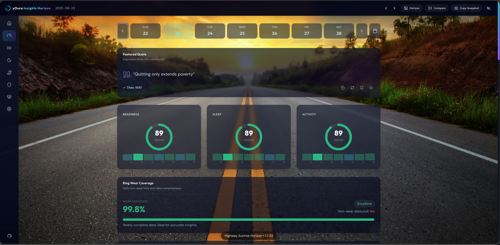

## Features

- Upload exported Oura CSV files and generate a local dashboard.
- Supports partial exports when at least one primary dataset is available.
- Semantic score colors for Poor, Fair, Good, and Optimal states.
- Multi-level drilldowns for detailed daily, weekly, and monthly trends.
- Horizon Mode acts as a scenic image gallery with more than 30 horizon backgrounds to choose from.
- Particles Mode provides an alternate animated background.
- Featured Quote card.
- Hide Widgets mode for a clean background-only view.
- Compare Mode for checking Readiness, Sleep, and Activity across two dates.
- Full dashboard snapshots and individual card snapshots with human-readable data.
- Calendar navigation for jumping between available dates.

## Drilldowns

Cards open deeper views with contributors, key metrics, charts, trends, and nested detail modals. Many charts support day, week, and month ranges for quick trend exploration.

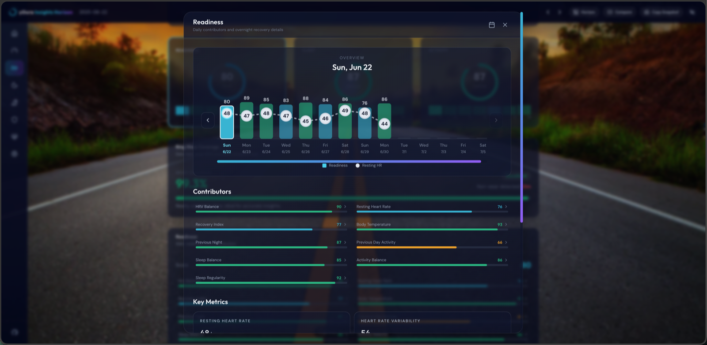

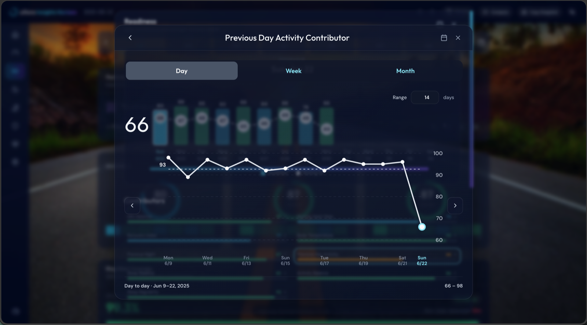

## Horizon Mode and Particles

Use the Horizon button to switch between frosted-glass dashboard views over scenic backgrounds and the animated particle background. Horizon Mode also works as a lightweight gallery viewer with a curated set of scenic horizon images.

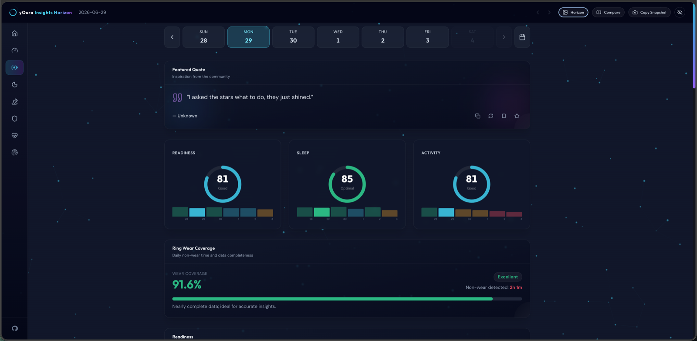

## Hide Widgets

Hide Widgets keeps the header visible while fading out dashboard cards so the selected Horizon background can take center stage.

| | | |
|---|---|---|
| 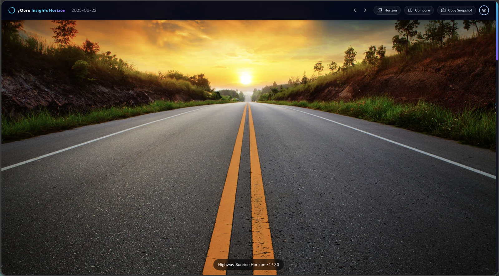 | 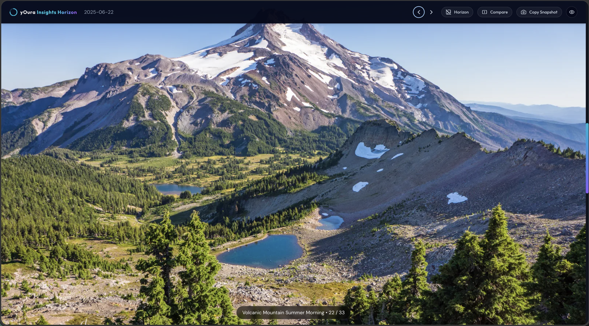 | 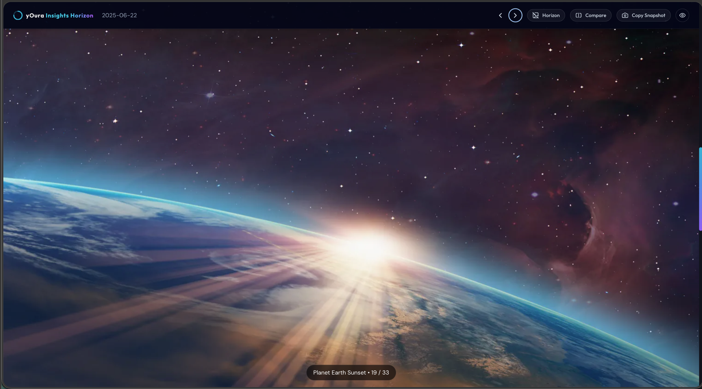 |
| 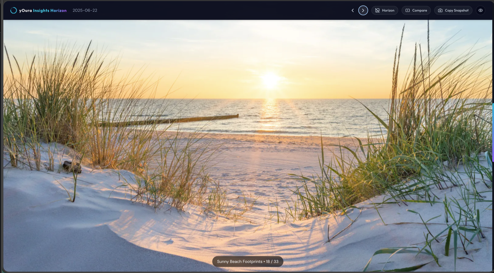 | 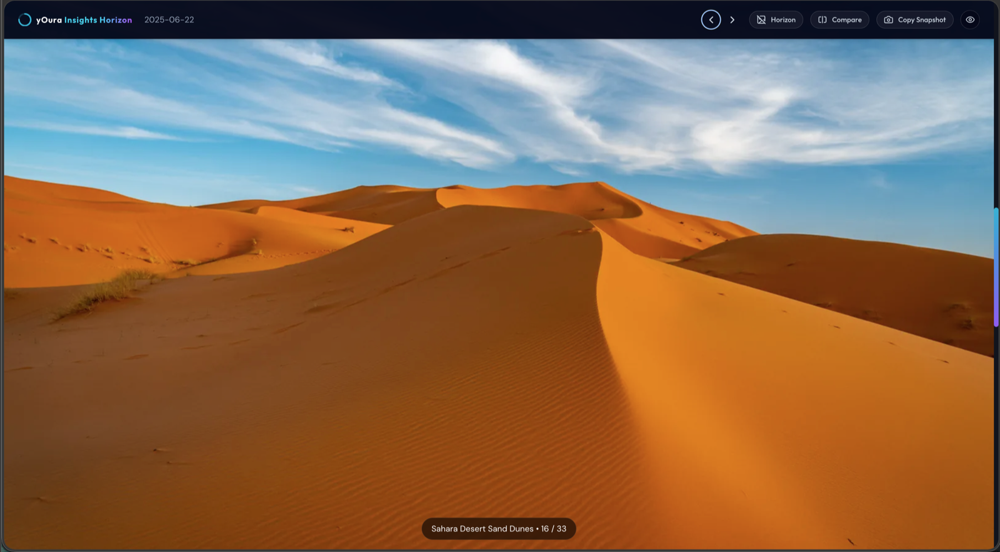 | 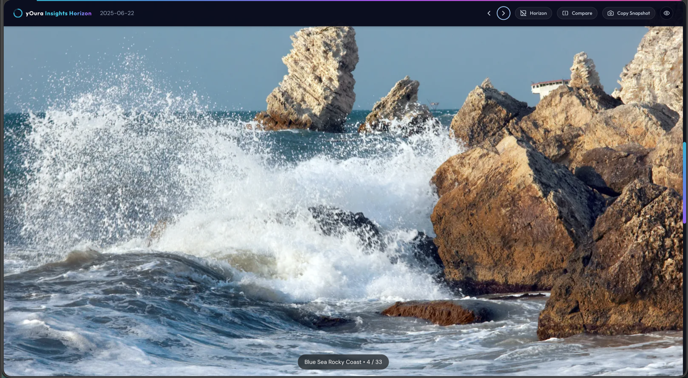 |

## Compare Mode

Compare Mode shows two independent dashboard panels so you can compare Readiness, Sleep, and Activity between any two available dates. Each panel supports contributor drilldowns.

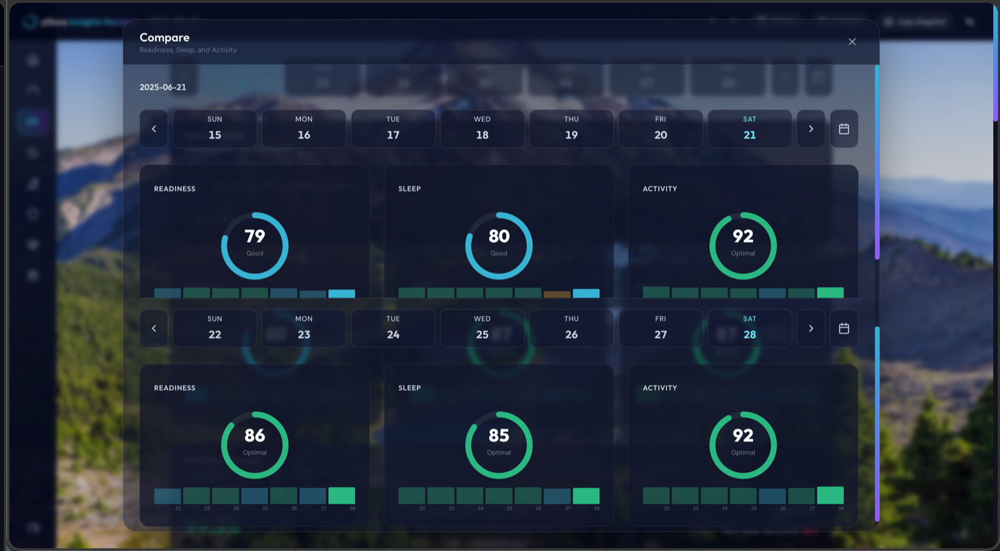

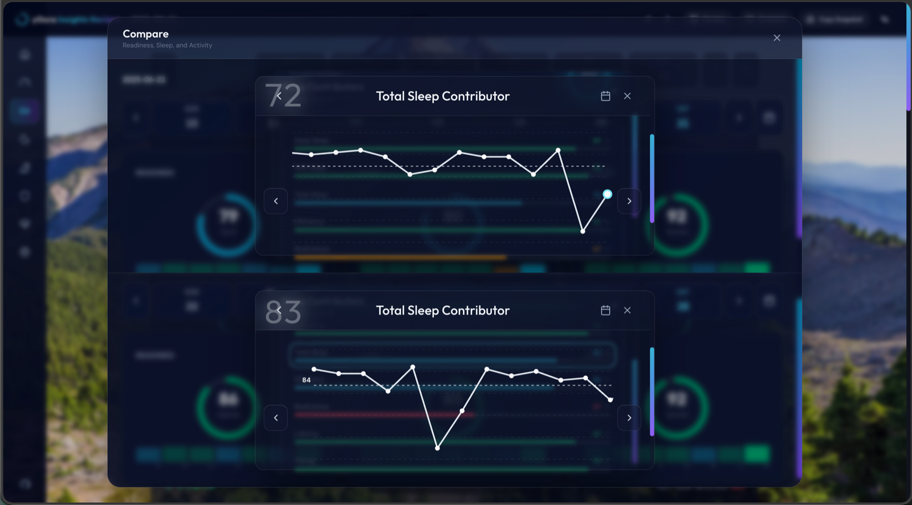

## Snapshots

Create shareable snapshots from the full dashboard or from individual cards.

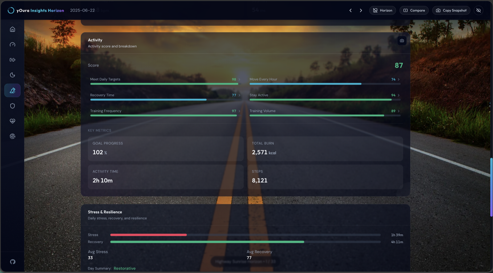

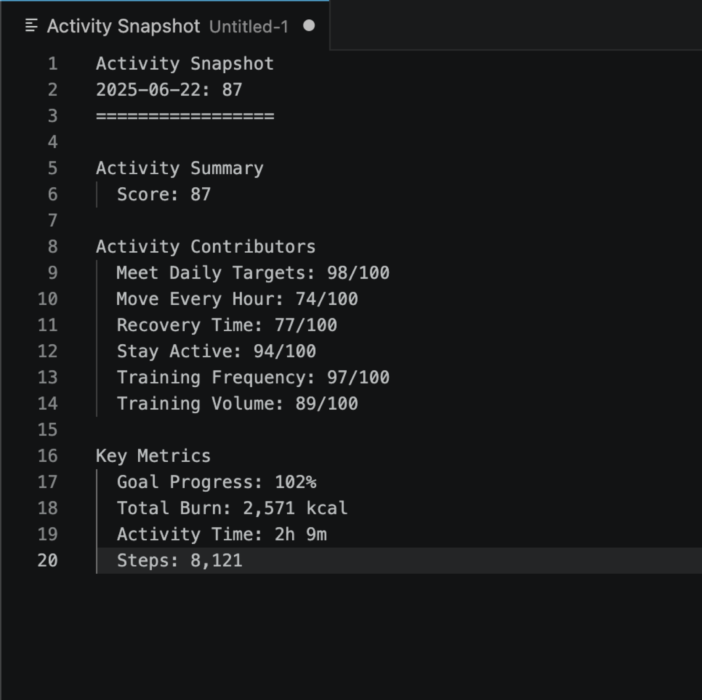

## Mock Data

The repo includes mock CSV datasets for testing uploads, dashboards, incomplete data, and long-range trends.

- `mock_data/user` (healthy active baseline profile)
- `mock_data/user_mixed`
- `mock_data/user_declining`
- `mock_data/user_increasing`
- `mock_data/data_corrupt` (problematic data set for testing validation)

> [!TIP]
> Use these datasets to explore the dashboard without uploading personal data, check edge cases, and test how the app handles missing or invalid exports.

## Roadmap

Planned improvements include:

- Drill-down modals for the Stress & Resilience card.
- More detailed informational cards that explain health and fitness metrics in plain language.
- Links to free resources that help users interpret trends and make healthier decisions.
